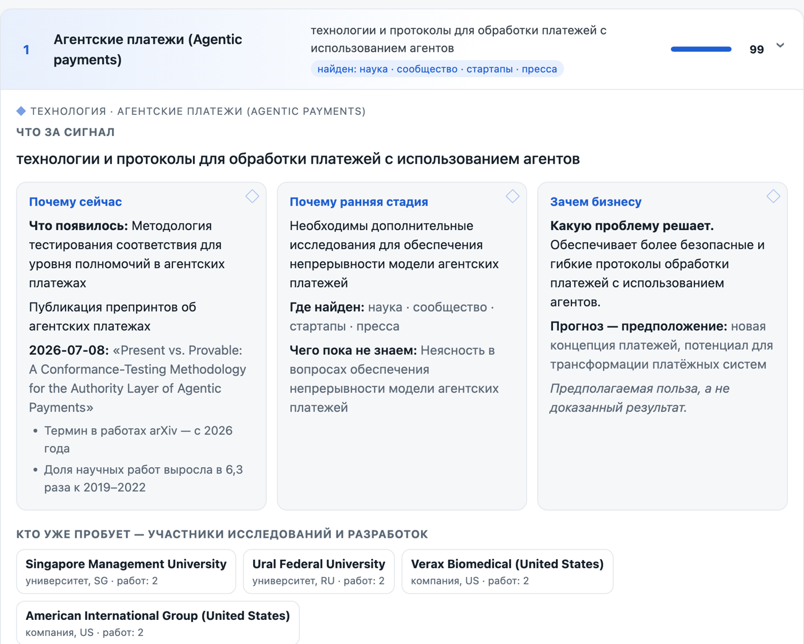
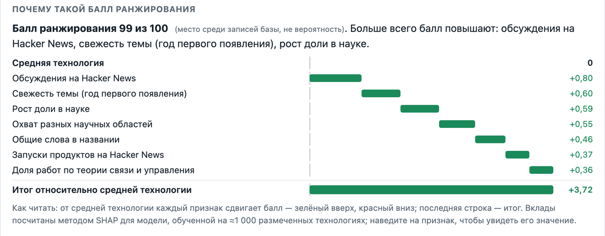
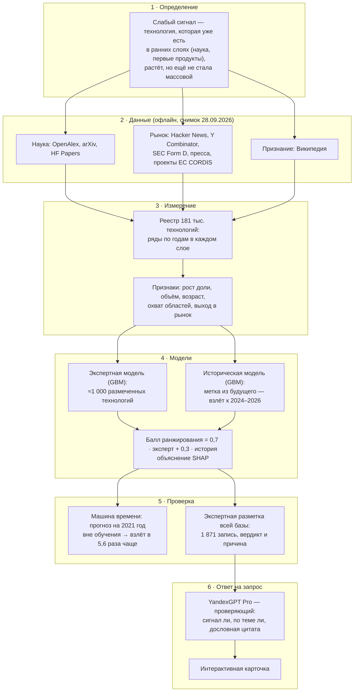

<p align="center">
  
</p>
<p align="center">
  <b>Задача Газпромбанк.Тех</b> · «Лидеры цифровой трансформации 2026» ·
  <a href="https://signal-radar.ru">signal-radar.ru</a> ·
  <a href="#запуск-за-две-команды">запуск за две команды</a>
</p>
<p align="center">
  
</p>

> **Слабый сигнал — это вывод в условиях неопределённости. Поэтому Предвестник не просит верить машине на слово.**
>
> У каждого вывода видна его база: источники с датой и дословной цитатой, данные по годам в науке, у разработчиков,
> стартапов и прессы, вклад каждого признака в балл. Эксперт может проверить, почему система пришла к такому
> выводу, — и решает сам, а не следует за моделью вслепую.

## Каждый сигнал — с объяснением

Мы не выдаём голый список. Про каждую технологию карточка отвечает на пять вопросов — по источникам и данным,
а не по мнению языковой модели:

| Вопрос | Чем отвечаем |
|---|---|
| **Что появилось?** | конкретное изменение в технологии — по источникам карточки |
| **Почему сейчас?** | датированное событие с дословной цитатой источника и рост в данных |
| **Почему это ещё ранняя стадия?** | где найден сигнал (наука → сообщество → стартапы → пресса → энциклопедия) и чего пока не знаем |
| **Зачем бизнесу?** | какую проблему решает — отдельно от доказанного результата |
| **Почему такой балл?** | вклад каждого признака в балл ранжирования (SHAP) и похожая динамика в прошлом |

<p align="center">
  
</p>

### Почему такой балл: SHAP

Каждый балл ранжирования разложен на вклады признаков: от средней технологии каждый признак сдвигает балл вверх
(зелёный) или вниз (красный), последняя строка — итог. Так видно, из чего сложилась оценка: рост доли в науке,
обсуждения разработчиков, свежесть темы, охват научных областей. Вторая модель — историческая — показывает свой
разбор отдельно.

<p align="center">
  
</p>

**Главная идея.** Мы не спрашиваем у языковой модели, что сейчас в тренде. Заранее, по офлайн-корпусу, мы собираем
**базу слабых сигналов**: для каждой технологии измеряем, как она ведёт себя в открытых источниках (рост в науке,
выход в стартапы, прессу, проекты ЕС, нет ли уже энциклопедической статьи), оцениваем двумя объяснимыми моделями и
вычищаем всё, что эксперт не признал бы слабым сигналом. На запросе YandexGPT только выбирает из этой базы и
проверяет каждый кандидат по источникам.

## Логика решения



Каждое звено можно проверить отдельно: определение задаёт, что измеряем; данные — только открытые и датированные;
модели объяснимы (SHAP); проверка на прошлом объективна (метка из будущего, без чьей-либо разметки); языковая модель
на запросе не решает, что является сигналом, а только проверяет кандидатов из базы по их источникам.

## Что в решении сильного

- **Проверка на прошлом.** Прогноз на конец 2021 года вне обучения: из топ-30 модели к 2024–2026 взлетели 30 %
  против 5,4 % в среднем — в 5,6 раза чаще (95 % интервал 2,5–8,8).
- **Две объяснимые модели.** Экспертная — по разметке «сигнал или нет», историческая — по тому, что реально
  взлетело. Вклад каждого признака в балл — SHAP в карточке.
- **Составные сигналы «метод ИИ × объект».** LLM для ПЛК, VLM для контроля качества: устойчивого термина нет, но
  растут работы и проекты ЕС (CORDIS).
- **Паспорт с дословной цитатой.** Цитата сверяется с источником программно; технология, сигнал и прогноз разведены.
- **Где найден сигнал — измерено.** Наука → сообщество → стартапы → пресса → энциклопедия.
- **Участники исследований и разработок.** Организации из свежих работ OpenAlex, стартапы YC, раунды SEC Form D.
- **Похожая динамика в прошлом.** Тема 2021 года с похожей траекторией и её исход.
- **Отсечение данными.** Зрелость, академия без рынка, обрывки, финтех — правилами по данным, а не словами модели.

## Запуск за две команды

```bash
git clone https://github.com/weak-signals-forecast/predvestnik.git && cd predvestnik
cp .env.example .env                 # ключ YandexGPT (YANDEX_API_KEY, YANDEX_FOLDER_ID); без него — выдача без модели
docker compose up -d db registry     # витрина: http://localhost:8010, API и документация: http://localhost:8010/docs
```

```bash
curl -s -X POST localhost:8010/api/registry/search -H 'Content-Type: application/json' \
     -d '{"query": "перспективные технологии в финтехе"}'
curl -s localhost:8010/api/registry/health
```

Корпус для ответа не нужен: всё, что нужно сервису, лежит в `artifacts/registry` (в репозитории). Образ `registry` —
Python, torch для процессора и векторная модель USER-bge-m3 (около 5 ГБ); сервис работает на обычном ноутбуке без
видеокарты и занимает около 1 ГБ оперативной памяти. Ответ на запрос — до минуты: 1 вызов YandexGPT Lite
(HyDE) и не больше 4 вызовов YandexGPT Pro. Подготовка данных идёт отдельно и заранее: сбор офлайн-корпуса — около
2,5 суток один раз, сборка базы и моделей — несколько часов.

## Карточка сигнала

Карточка отвечает на вопрос пользователя «что появилось и почему мне стоит обратить внимание?» и разводит три вещи:
**технологию** (заголовок), **сигнал** (конкретное датированное событие внутри направления) и **прогноз** (что это
может изменить — предположение). Источники подтверждают событие, модель оценивает его значимость, прогноз остаётся
предположением.

1. **Что за сигнал** — конкретное технологическое изменение, двумя предложениями.
2. **Почему сейчас** — событие, подтверждённое дословной цитатой источника с датой, и рост в данных.
3. **Почему ранняя стадия** — что уже подтверждено, где найден сигнал (слои корпуса), чего пока не знаем.
4. **Зачем бизнесу** — какую проблему решает; предполагаемая польза отдельно от доказанного результата.
5. **Кто уже пробует** — участники исследований и разработок: компании, университеты, лаборатории с двумя и более
   работами по теме, стартапы YC (аффилиация авторов — участие в исследованиях, а не доказательство внедрения).
6. **Доказательства** — два-три ключевых источника с пояснением, что каждый подтверждает.
7. **Подробнее** — факты из данных, «где найден сигнал», ряды по годам, балл ранжирования и его разбор SHAP,
   все участники, «похожая динамика в прошлом» (тема 2021 года с похожей траекторией; сходство кривых не доказывает
   сходство будущего), все источники с названием, ссылкой, датой, типом, языком и уровнем доверия.

В свёрнутой строке — название, одно конкретное изменение, где найден сигнал и балл ранжирования (0–100, место среди
записей базы, не вероятность). Под ТОП-15 — ещё сигналы по теме, проверенные YandexGPT, и кандидаты из базы.

## Модели и проверка

- **Экспертная модель** — градиентный бустинг на ≈1 000 технологиях, размеченных по критерию слабого сигнала, плюс
  известные сигналы. **Историческая** — тот же бустинг на истории: признаки на конец 2021 года, метка из будущего —
  взлетела ли тема к 2024–2026 (без чьей-либо разметки). Итоговый балл — 70 % экспертной и 30 % исторической.
  Обе объяснены через SHAP: в карточке — вклад каждого признака в балл.
- **Проверка на прошлом.** Прогноз на конец 2021 года, модель этих технологий при обучении не видела: из 30 технологий,
  которые она поставила бы наверх, к 2024–2026 взлетели 30 % — против 5,4 % среди всех 22 678 технологий 2021 года,
  в 5,6 раза чаще (95 % интервал 2,5–8,8). Среди попаданий — machine unlearning (×19) и автономный ИИ (×14,5, 14
  стартапов YC). Промахи показаны на витрине. Скрипт: `python -m registry.time_machine`.
- **Модели:** YandexGPT Lite, YandexGPT Pro, USER-bge-m3 (локально, Hugging Face), градиентный бустинг
  (scikit-learn).

## Этап 1: модель на размеченном датасете

Кросс-валидация 5 × 10: accuracy 86 %, precision 74 %, recall 87 %, F1 80 %. 

## PostgreSQL

При старте база и связи «кто стоит за сигналом» загружаются в `registry_signals` и `registry_actors`, каждый запрос
с ответом пишется в `registry_runs`.

## Наши собственные идеи

- **Прогноз взлёта.** Вероятность, что за 3–5 лет научных работ станет минимум втрое больше. Обучена на 2019–2020,
  проверена на 2021 на невиданных технологиях: AUC 0,79; в топ-20 прогнозов взлетели 90 % против 48 % в среднем.
  Признаки — относительно технологий того же года.
- **Реестр прогнозов.** Прогноз фиксируется с датой и критерием успеха; `python -m wsignals.takeoff score` через три
  года проверит, сбылся ли он. Прогноз можно опровергнуть.
- **Машина времени.** Признаки на конец 2021 года — только по данным до этой даты. Будущий мейнстрим модель отмечала
  как слабый сигнал в 25 % случаев, зрелое — в 4 % (p = 0,003): различает стадию, а не запоминает названия.
  Отчёт: `reports/timemachine.md`.
- **Исторический двойник.** Технология 2021 года с самым похожим набором признаков и то, чем она стала: «похожа на
  векторные базы данных в 2021 году — они стали мейнстримом». Только при полном векторе признаков.
- **Лестница зрелости.** Наука, код, сообщество разработчиков, медиа, энциклопедия: у слабых сигналов в среднем
  1,4 ступени, у зрелых — 4,1.
- **Тест на утечку из будущего.** Данные после даты среза заменяются мусором — признаки не должны измениться. Тест
  нашёл две настоящие ошибки, обе исправлены.

## Где что лежит

```
registry/                база слабых сигналов: реестр, отбор, модели, паспорта, составные, сборка
registry_service/        сервис registry: FastAPI, поиск по базе, выбор YandexGPT, PostgreSQL
web/                     витрина (открывается из сервиса registry)
artifacts/registry/      всё, что нужно сервису для ответа: база, векторы, карточки
data/labels/             разметка: экспертная разметка базы, отрицательные примеры
docs/                    методология, обоснование подхода, иллюстрации
```
