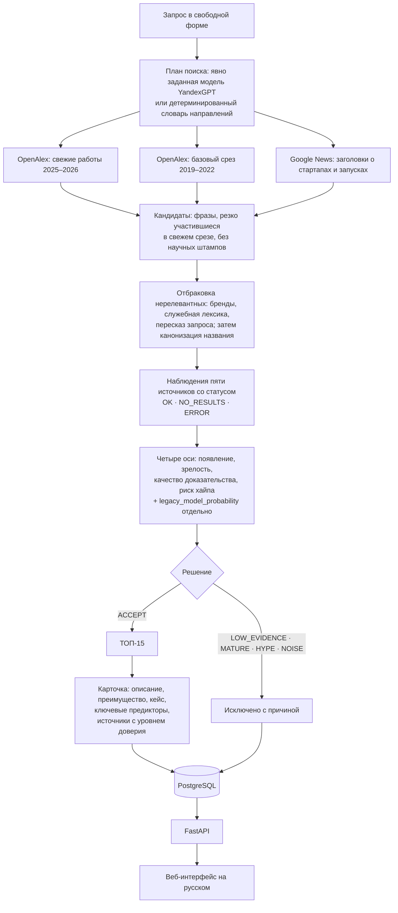

# Методология и архитектура

Техническая документация к решению задачи «Сервис для автоматизированного сбора и анализа зарождающихся трендов (слабые сигналы) в научно-технологических отраслях» (ЛЦТ2026, Газпромбанк.Тех).

## Как система понимает, что такое слабый сигнал

Слабый сигнал в этой системе это технология на ранней стадии, у которой уже есть проверяемые следы в нескольких независимых источниках, но ещё нет признаков зрелости. Система не спрашивает у языковой модели, что сейчас в тренде. Она измеряет, как технология ведёт себя в открытых источниках, и сравнивает это поведение с технологиями, чья судьба известна.

| Вопрос | Источник | Признак зрелости | Признак раннего сигнала |
|---|---|---|---|
| Есть ли научная база и растёт ли она | OpenAlex, включая arXiv | много лет публикаций, много научных областей | мало работ, резкий рост, высокая доля препринтов |
| Реализована ли технология в коде | GitHub | тысячи репозиториев | немного репозиториев, большая доля созданных за год |
| Обсуждают ли разработчики | Hacker News | давние обсуждения | обсуждения появились недавно |
| Насколько тема в медиа | Google News, русские и зарубежные издания | насыщенный поток новостей | немного изданий, свежие публикации |
| Признана ли технология общим знанием | Википедия | отдельная статья много лет, много просмотров | статьи нет |

## Этап 1: обучение

### Датасет

Таблица организаторов «100 слабых технологических сигналов» содержит только положительные примеры: в ней нет зрелых технологий и хайпа, на которых модель могла бы учиться их отличать. Поэтому датасет достроен по явным критериям ТЗ. Таблица организаторов и производные от неё файлы в репозиторий не входят.

| Класс | Число | Критерий | Откуда |
|---|---|---|---|
| Слабый сигнал | 100 | размечен методологами | таблица организаторов |
| Зрелая технология | 150 | массовое внедрение, сформированный рынок, стандарт, либо общий зонт-термин | [`data/labels/negatives.yaml`](../data/labels/negatives.yaml) |
| Угасший хайп | 48 | массовое внимание в прошлом, пик пройден, внедрения не случилось | там же |

Отрицательные примеры взяты из тех же шести областей, по 25 зрелых и 8 угасших на область. Так модель не может отличать классы по теме, только по поведению в источниках. Среди зрелых намеренно есть трудные примеры, близкие к слабым сигналам по смыслу: «federated learning» как общий термин против «федеративного обучения для межбанковского AML», «prompt injection» против «самозалечивающейся защиты агентов от prompt injection».

Колонки таблицы организаторов «стадия», «тренд» и «балл» в признаки не входят. У отрицательных примеров их нет, и на открытом запросе их тоже не будет. Стадия нормализована в порядковую шкалу и используется только для проверки согласованности.

### Признаки

22 признака в пяти группах, одна функция для обучения и для открытого запроса: [`wsignals/features.py`](../wsignals/features.py). Счётчики переводятся в логарифмы и доли, чтобы технологии с разным объёмом литературы были сравнимы. Каждый источник может отказать. Отказ сохраняется в данных явным статусом (`*_status`, `*_error`), счётчики
отказавшего источника в данные не попадают: ноль вместо ошибки запрещён, потому что для модели «нет следа» —
это довод в пользу слабого сигнала. Сбор при этом продолжается.

Критерии отбора признаков:
- признак должен быть доступен на любую технологию по открытому API без платных баз;
- признак должен иметь понятный аналитику смысл, чтобы объяснение модели читалось без статистики;
- признак не должен зависеть от формулировки разметки: проверено, что длина поисковой фразы не улучшает модель, и она не используется.

### Модель и оценка

Всё в этом разделе — **историческая метрика базового предиктора этапа 1** на собственной разметке команды (100 сигналов организаторов и 198 отрицательных примеров, составленных командой). Это **не** качество итогового решения открытого запроса: ТОП-15 этапа 2 решает слой четырёх осей и шлюзов доказательства, а модель этапа 1 в нём не участвует (`legacy_model_probability`). Качество ТОП-15 на запросах жюри этими числами не измерено.

Сравниваются логистическая регрессия и градиентный бустинг. Выбирается модель с лучшим F1 класса «слабый сигнал», при равенстве более прозрачная.

| Проверка | Accuracy | Precision | Recall | F1 |
|---|---|---|---|---|
| Кросс-валидация 5 × 10 по группам, логистическая регрессия | 86 % | 74 % | 87 % | 80 % |
| Перенос на невиданную область: одна из шести в тесте | 85 % | 74 % | 86 % | 79 % |

Вторая строка показывает перенос базового предиктора на область, которой он не видел при обучении. К качеству ТОП-15 на направлении, заданном жюри, она не относится: эту выдачу формирует слой решения этапа 2, а не модель этапа 1.

### Интерпретируемость

Для каждой технологии вклад признака в решение считается как коэффициент логистической регрессии, умноженный на стандартизованное значение. В интерфейсе это раздел «Почему это слабый сигнал»: например, «↓ число репозиториев: 12», «↑ доля препринтов: 47 %». Глобальная важность считается перестановкой признаков.

Сильнее всего к «не сигнал» толкают число репозиториев и упоминания в Википедии, к «слабый сигнал» доля препринтов и число свежих публикаций.

## Машина времени и лестница зрелости

Признаки восстановлены на конец 2021 года только по данным до этой даты. Технологии, которые тогда только появлялись и к 2026 году стали мейнстримом, модель в 2021 году относила к слабым сигналам в 25 % случаев, а уже зрелые в 4 %: точный тест Фишера p = 0,003, AUC 0,79. По этой же проверке выбран порог второго эшелона «под наблюдением».

Модель обучена на разметке 2026 года. Если она распознаёт стадию, а не запоминает названия, то на признаках, восстановленных на конец 2021 года, она должна отнести к слабым сигналам технологии, которые тогда только появлялись и к 2026 году стали мейнстримом. Признаки на прошлую дату восстанавливаются только по данным до неё: годовые ряды публикаций, репозитории с датой создания, истории Hacker News, дата создания статьи в Википедии. Каждая технология оценивается моделью, обученной без неё. Отсутствие утечки из будущего проверяется тестами. Отчёт: [`reports/timemachine.md`](../reports/timemachine.md).

Лестница зрелости это число слоёв, в которых технология уже появилась: наука, код, сообщество разработчиков, массовые медиа, энциклопедия. Слабый сигнал обычно уже в науке и коде, но ещё не в энциклопедии. Ступень считается автоматически.

## Прогноз взлёта

Модель этапа 1 отличает раннюю стадию от зрелой, но не говорит, вырастет ли технология. Для этого есть вторая модель ([`wsignals/takeoff.py`](../wsignals/takeoff.py)), идея которой перенесена из исследовательской версии проекта.

- **Метка из будущего.** Взлёт, если среднегодовое число научных публикаций через 3–5 лет минимум втрое выше, чем за три года до даты прогноза, и за эти годы набралось не меньше 15 работ. Удвоение оказалось слишком лёгким критерием: в 2021–2026 годах так росла почти вся литература по ИИ.
- **Признаки на дату.** Те же, что в машине времени, но относительно всех технологий того же года: без этого модель, обученная на 2019–2021 годах, видела бы взлёт почти у любой технологии 2026 года.
- **Проверка.** Обучение на 2019–2020 годах, тест на 2021 году, пятикратно по группам технологий, так что ни одна технология теста не встречается в обучении. AUC 0,79, точность топ-20 90 % при базе 48 %.
- **Ограничение.** Метка измеряет рост научных публикаций, а не рынок: о NFT-маркетплейсах научных работ стало больше, хотя как рынок это угасший хайп. Поэтому прогноз взлёта — дополнение к оценке стадии, а не замена ей. В интерактивной выдаче он показывается только при полном векторе признаков (`forward_looking_supported`); на живом пути счётчики GitHub по умолчанию не запрашиваются, и прогноза там нет.
- **Реестр.** Каждый прогноз записывается с датой и критерием, команда `python -m wsignals.takeoff score` проверяет его по данным будущих лет.

## Этап 2: открытый запрос

### Кандидаты

Кандидаты извлекаются методом, проверенным в исследовательской версии проекта. Берутся фразы из 2–4 слов, которые встречаются в свежих работах по запросу заметно чаще, чем в работах 2019–2022 годов. Научные штампы вроде «have explored» и «unlike traditional» отсекаются сравнением с фоном: частота фразы в корпусе запроса делится на её частоту в работах по несвязанным областям (медицина, образование, гидрология, лингвистика и другие). Если фраза встречается в запросе меньше чем втрое чаще, чем в фоне, это штамп. Это развитие энтропийного фильтра из исследовательской версии: там штамп определялся как фраза, размазанная по темам, но на корпусе одного запроса темы OpenAlex слишком дробные, и этот критерий отсекал настоящие термины. Фраза должна встречаться в заголовках, а не только в аннотациях. Вложенные фразы склеиваются.

### Состояние доказательства: OK, NO_RESULTS, ERROR

Раньше отказ источника превращался в нули признаков, а нули модель этапа 1 читает как «технология никому
не известна»: отсутствие данных повышало уверенность в слабом сигнале. Теперь каждое обращение к источнику
возвращает наблюдение с явным статусом ([`wsignals/evidence.py`](../wsignals/evidence.py)):

| Статус | Что это | Что с ним делают |
|---|---|---|
| `OK` | источник ответил и что-то нашёл | значения идут в расчёт |
| `NO_RESULTS` | источник ответил, по фразе ничего нет | валидный ноль, идёт в расчёт |
| `ERROR` | источник не ответил | числом ноль **не становится**, в расчёт не идёт |

Это правило распространяется и на **сбор корпуса**. Новостной срез корпуса раньше сворачивал любой отказ
в пустой список и получал статус `NO_RESULTS`, то есть «источник ответил». Живой прогон показал цену: три
широких запроса подряд отчитались об ответе источника, хотя ни одна лента не была ни получена, ни
разобрана. Теперь HTTP-ошибка, 429, сетевой сбой, исчерпанный дедлайн и страница вместо RSS (блокировка
или согласие на cookie) дают `ERROR` — или `PARTIAL`, если часть запросов всё же принесла заголовки, — и
перечисляются в статистике запроса. `NO_RESULTS` остаётся только за успешно полученной и разобранной
лентой без записей.

Инварианты закреплены тестами: отказ источника не может повысить ни `emergence_score`, ни
`evidence_confidence`; при отказе всех источников принять кандидата нельзя ни при каком значении модели;
валидный ноль и отказ различимы в выдаче, в журнале адаптеров и в базе.

Отдельный случай — Википедия. Её отказ нельзя прочитать как «отдельной статьи нет», поэтому риск зрелости
становится «неизвестно» (0,5), а не нулём, и эта оговорка печатается в карточке.

### Четыре оси решения

Вопрос включения больше не решает одна вероятность. Решение разложено на четыре измеряемые оси
([`wsignals/decision.py`](../wsignals/decision.py)), каждая из которых отдаётся отдельным полем:

| Ось | Что измеряет | Из чего считается |
|---|---|---|
| `emergence_score` | насколько технология появляется именно сейчас | всплеск в литературе, рост публикаций, доля свежих репозиториев, доля препринтов, свежесть новостей и обсуждений |
| `maturity_risk` | насколько она на самом деле зрелая | взвешенное среднее шести признаков, см. ниже |
| `evidence_confidence` | насколько есть на что опираться | число независимых семейств источников, доверие, полнота опроса адаптеров |
| `hype_risk` | насколько след объясняется маркетингом | доля пресс-релизов, внимание медиа без научного и инженерного следа, угасание после пика |

Итог: `decision` ∈ {`ACCEPT`, `LOW_EVIDENCE`, `MATURE`, `HYPE`, `NOISE`} с полем `decision_reasons`.
Правила простые и монотонные, пороги вынесены в именованные константы и под текущую разметку не подбирались.

Вероятность модели этапа 1 остаётся в карточке как `legacy_model_probability` рядом с флагом
`legacy_model_reliable`. Это предиктор и элемент объяснения, но не право включения и не право вето.
Модель в этой задаче не переобучалась.

### Единственная авторитетная терминальная классификация

Терминальный статус кандидата задаёт **только** поле `decision`. Человекочитаемые `tier` и `status`
выводятся из него таблицей и собственного порога не имеют:

| `decision` | `tier` | `status` |
|---|---|---|
| `ACCEPT` | подтверждённый слабый сигнал | слабый сигнал |
| `LOW_EVIDENCE` | требует дополнительных доказательств | под наблюдением |
| `MATURE` | исключён как зрелая технология | исключён |
| `HYPE` | исключён как маркетинговый шум | исключён |
| `NOISE` | исключён как шум | исключён |

Раньше `status` считался по отдельному порогу, и в полосе появления `[0,15; 0,30)` выдача противоречила
сама себе: `decision = ACCEPT`, `tier = подтверждённый`, `status = под наблюдением`. Второго
классификатора в `status` больше нет; счётчики `accepted_count`, `weak_signal_count`, `watchlist_count`
и `rejected_count` выводятся из одного и того же решения. Границы полосы (0,149 / 0,150 / 0,151 /
0,299 / 0,300) закреплены тестами; пороги при этом не менялись.

### Намерение пользователя и предметная область

Запрос «слабые сигналы в кибербезопасности» состоит из двух разных вещей:

| часть | пример | роль |
|---|---|---|
| намерение | «слабые сигналы» | КАК искать: режим горизонт-сканирования |
| область | «кибербезопасность» | ЧТО искать в источниках |

Поисковые фразы строятся по **области**. Раньше слова о задаче уходили в поиск буквально, и по запросу
про кибербезопасность система находила работы об обнаружении слабых сигналов — акустику, отношение
сигнал/шум, обработку импульсов. Разделение выполняется до обращения к модели, модель получает область
отдельным полем и явный запрет использовать слова о задаче как тему поиска, а детерминированный путь
подчиняется тому же контракту. Если модель всё же вернула пересказ намерения, такие фразы вычищаются
из плана; если после этого план пуст — используется детерминированный разбор.

**Разбор запроса и идентичность кандидата — разные задачи**, и словарь первой не является чёрным
списком для второй. Первая версия ремонта вычитала слова намерения безусловно и искала их подстрокой
в названиях кандидатов. Независимая проверка показала цену: «methods for weak acoustic signal
detection» превращалось в «methods acoustic detection», а «weak signal detection», «early warning
radar», «numerical weather forecast» и «crop yield forecast» переставали быть технологиями вообще.

Поэтому действуют два разных правила.

*В запросе* вычитаются только участки, распознанные как описание задачи. Маркеры с общей рубрикой
в вершине («перспективные технологии», «emerging technologies», «зарождающиеся тренды») — всегда
задача. Маркеры с содержательной вершиной («слабые сигналы», «weak signals», «early warning») —
задача только в инструктивной рамке: перед ними нет предметных слов, а после идёт предлог,
вводящий область. «Слабые сигналы **в** агротехе» — задача; «усилители слабых сигналов в
радиоастрономии» и «weak signal propagation» — предмет, и он сохраняется полностью.

*В кандидате* отбраковывается фраза, **каждое** слово которой взято из служебной, рубричной или
дискурсивной лексики: «horizon scanning», «future research directions», «related work section»,
«technology trend report». Стоит появиться одному слову с собственным техническим содержанием — фраза
остаётся кандидатом. Ни «weak», ни «signal», ни «early warning», ни «forecast», ни «readiness», ни
«awareness», ни «report» сами по себе основанием для отказа не являются.

### Ограничение семантической проверки по времени

Семантическая проверка идёт **растущими порциями по короткому списку**, а не одним вызовом на всех
кандидатов.

Первая версия ограничения делила список на порции, но таймаут вызова считался как «весь остаток
фазы». Поэтому первый же вызов забирал 100 % возможности проверки: на живых прогонах в каждом запуске
случался ровно один вызов, две трети запусков не проверили ничего, треть проверила восемь кандидатов.
Машинерия частичного успеха существовала, но включиться не могла.

Попытка «начинать с малого» это не исправила, а сломала иначе. У провайдера задержка почти
ЦЕЛИКОМ фиксированная: живое измерение владельца — порция из восьми фраз отвечает за 6–8 с, и размер
порции на это влияет слабо. Маленькая порция стоит столько же, сколько большая, зато предельный
таймаут, срезанный долей остатка (0,6 от восьмисекундной фазы — 4,8 с), оказывается НИЖЕ фиксированной
задержки, и не успевает ничего. Замер на модели провайдера: при задержке 5–7 с прежняя схема давала
восемь проверенных, схема «с малого» — ноль.

Поэтому семантическая фаза получает **гарантированный пол** внутри того же сетевого окна, первый
вызов идёт **полной порцией** и получает всё, кроме явного **резерва восстановления**, а после
таймаута порция делится пополам и повторяется в пределах резерва. Пол ограничен долей остатка: на
коротком бюджете фаза не имеет права забрать всё оставшееся время.

| параметр | значение | смысл |
|---|---|---|
| короткий список | 24 | сколько кандидатов вообще доходит до дорогой проверки |
| порция (потолок и старт) | 8 | первая попытка реалистична для провайдера |
| минимальная порция | 2 | ниже этого размер не опускается |
| пол бюджета фазы | 18 с | хватает и на реалистичный вызов, и на восстановление |
| доля бюджета фазы | 0,15 | нижняя оценка, когда остатка много |
| предел доли остатка | 0,35 | фаза не съедает всё оставшееся время |
| резерв восстановления | 8 с | столько остаётся на повтор половинной порцией |
| минимальный бюджет вызова | 3 с | ниже него вызов не начинается |
| предел попыток | 8 | повторы ограничены, шторма запросов нет |

Семантическая проверка — обязательный шлюз допуска: без неё ни один кандидат не может быть принят,
поэтому фазе гарантируется пол, а не только доля. Общая стена 90 с, сетевой дедлайн 82 с и резерв
финализации 8 с при этом не меняются; не меняются и доли корпуса, первой и второй ступеней. Время на
пол берётся у **третьей ступени и позднего дообогащения новостями**, которые работают на остатке и
сами останавливаются по бюджету. На живом состоянии владельца это +9,95 с фазе (8,05 → 18,0 с).

Отказ одной порции не отменяет остальные: проверенные кандидаты сохраняют проверку, непроверенные
остаются `DETERMINISTIC_ONLY` и подтверждены быть не могут. Контракт безопасности не ослабляется.
Все числа входят в отпечаток конфигурации.

### Отвергнутый токен GitHub не должен убирать семейство «код»

Повтор без заголовка авторизации существовал в адаптере GitHub с прошлого ремонта, но живой путь его
не использовал: сбор корпуса ходил в поиск GitHub напрямую, минуя адаптер. Живая проверка владельца
показала цену — переменная окружения содержала просроченный токен, GitHub отвечал 401, и всё семейство
«код» отпадало у всех кандидатов сразу, хотя неавторизованный доступ к тому же поиску отвечал 200.

Теперь корпусный путь идёт через тот же адаптер: на 401/403 по авторизации делается ровно одна
попытка без токена, и при её успехе корпус GitHub остаётся `OK` с меньшим лимитом запросов. Лимит
запросов классифицируется как `rate_limit` и авторизацию не сбрасывает; сетевой отказ, таймаут и
прочие коды сохраняют прежние классы. Второй реализации запроса к GitHub в коде нет.

### Отказ источника это не отсутствие хайпа

Риск хайпа и **достаточность доказательства хайпа** — разные вещи.

Измеренный дефект: все ветки расчёта включались только при успешном ответе источника, поэтому ОТКАЗ
провайдера давал `hype_risk = 0.0` — то есть выглядел как измеренное отсутствие хайпа. Один и тот же
кандидат с новостями OK и 90 % пресс-релизов получал `HYPE`, а с новостями ERROR — `ACCEPT`. Падение
источника делало принятие ЛЕГЧЕ, что прямо противоречит правилу «отказ источника это не ноль».

Теперь `ERROR` означает «хайп измерить нечем». Величина риска при этом не выдумывается: ни 1.0, ни
автоматического `HYPE` нет.

Достаточность привязана к КОНКРЕТНЫМ измерениям, а не к числу документов вообще. Первая версия
считала заменой любые три конкретных документа, и независимый аудит показал цену: три научные работы
и репозиторий «закрывали» медийное измерение, а тот же кандидат с новостями ERROR снова получал
`ACCEPT` вместо `HYPE`. Научная статья и репозиторий о маркетинговом шуме не говорят ничего.

Заменой служит только фактически сработавший признак хайпа ПО САМИМ ДОКУМЕНТАМ — перепечатки,
перекос в промо, концентрация происхождения. Отсутствие сигнала в немедийных документах
доказательством отсутствия хайпа не является: тогда кандидат не принимается с кодом
`hype_evidence_unavailable`. `NO_RESULTS` — это ответ источника, он по-прежнему считается измерением.
В карточке состояние видно отдельным полем `hype_measured`: неизмеренный хайп не выдаётся за
уверенный ноль.

### Состояние семантической проверки

Подтверждение опирается не только на счётчики. У каждого кандидата есть состояние проверки:

| Состояние | Что значит | Может ли быть подтверждён |
|---|---|---|
| `SEMANTICALLY_VERIFIED` | нормализация прошла, модель подтвердила технологию и связь с направлением | да |
| `DETERMINISTIC_ONLY` | нормализации не было, лексика чистая | только при детерминированном признаке технологии |
| `SEMANTIC_UNCERTAIN` | нормализации не было, лексика неоднозначна | нет |

| Состояние | Может ли быть подтверждён |
|---|---|
| `SEMANTICALLY_VERIFIED` | **да** |
| `DETERMINISTIC_ONLY` | нет |
| `SEMANTIC_UNCERTAIN` | нет |

Окончательное подтверждение даёт **только** успешная семантическая нормализация. Морфологический
признак `high_certainty` (головное слово-процесс плюс содержательное определение) вычисляется,
показывается в карточке и участвует в объяснении, но права на `ACCEPT` у него нет: проверка на свежих
состязательных фразах показала, что правило смотрит на позицию головного слова и поэтому пропускает
перевёрнутые n-граммы («… poisoning» вместо «poisoning …») и обрывки со служебным словом. Словаря
технологий и списков фраз-исключений в коде нет — это закреплено тестом.

**Отказ языковой модели — рабочее состояние продукта, а не авария.** Поиск идёт, доказательства
материализуются, вето зрелости, хайпа и шума работают, кандидаты ранжируются в список наблюдения
с приложенными источниками и кодом `semantic_verification_pending`. Подтверждённых сигналов при этом
нет вовсе — сервис не выдаёт уверенность, которой у него нет.

### Что требуется для ACCEPT

Принятый сигнал обязан удовлетворять трём условиям одновременно:

1. **агрегатная достаточность** — минимум два независимых семейства источников и `evidence_confidence` ≥ 0,45;
2. **конкретное доказательство приемлемого качества** — документ разряда A или B, который к тому же
   является **первичным** для утверждения «технология существует». Пресс-релизы, сообщества и
   неопознанные издания не проходят;
3. **независимое подтверждение** — минимум два различных **ключа независимости** среди подтверждающих
   документов и минимум два различных происхождения или семейства. Две работы одного издателя и десять
   перепечаток одного анонса независимым подтверждением не являются. **Одна научная работа — тоже одно
   свидетельство**: препринт и журнальная версия схлопываются в одно подтверждение, даже когда у них
   разные DOI, разные издатели и слегка разные заголовки. Работа опознаётся детерминированно, по
   каноническому адресу, полному DOI, набору содержательных слов заголовка и заголовочному ядру до
   подзаголовка — без сети, без модели, без белых списков журналов. Порог консервативен: заголовки
   должны быть сопоставимой длины и почти полностью вкладываться друг в друга, поэтому общая тема
   двух разных работ их не склеивает. Отдельно учтён обычный приём журналов — добавить к заголовку
   препринта подзаголовок после двоеточия или тире: полный заголовок одной версии сравнивается с
   ядром другой и никогда ядро с ядром, поэтому «Adaptive photonic control: quantum sensor
   calibration» и «Adaptive photonic control: integrated LiDAR arrays» остаются разными работами,
   несмотря на общее начало. Версии одной работы собираются как связные компоненты отношения
   тождества, поэтому результат не зависит от порядка документов. Число схлопнутых версий видно
   в диагностике как `same_work_merges`;
4. **семантическая проверка** — см. выше.

Шлюз проверяется на состязательных случаях: неопознанное издание, только пресс-релиз, только
сообщество, два документа одного издателя, агрегатор с пресс-релизом, наука с независимой реализацией,
реестр с техническим свидетельством.

Если агрегатные счётчики обнадёживают, а конкретных документов получить не удалось, это
`LOW_EVIDENCE` с кодом `supporting_evidence_not_materialized`, а не принятый сигнал. Документы берутся
из уже полученного корпуса запроса, поэтому проверка не стоит ни одного дополнительного запроса.

Каждое решение несёт и человекочитаемые причины (`decision_reasons`), и машиночитаемые коды
(`decision_reason_codes`): `accepted`, `supporting_evidence_not_materialized`, `no_independent_corroboration`,
`insufficient_corroborating_families`, `lead_only_evidence`, `low_evidence_confidence`, `all_adapters_failed`,
`maturity_veto`, `hype_veto`, `semantic_rejection`, `industry_standard`, `budget_exhausted`,
`not_evaluated_novelty_cut`, `no_measurable_emergence`.

### Семантика баллов

Семь публичных полей, и ни одно из них не называется «уверенностью модели»:

| Поле | Что это | Чем не является |
|---|---|---|
| `emergence_score` | насколько технология появляется сейчас | не вероятность |
| `maturity_risk` | риск, что она уже зрелая | — |
| `evidence_confidence` | качество доказательства: семейства, доверие, полнота опроса | не уверенность модели |
| `hype_risk` | риск маркетингового объяснения следа | — |
| `rank_score` | **ранжирующий балл**, порядок выдачи | не вероятность и не уверенность |
| `legacy_model_probability` | экспериментальный базовый предиктор этапа 1 | в решении не участвует |
| `legacy_model_reliable` | собран ли полный вектор признаков модели | — |

### Модель зрелости

Зрелость это взвешенное среднее измеримых признаков, каждый в [0, 1]:

| Признак | Вес | Шкала насыщения |
|---|---|---|
| объём научного следа | 0,28 | 3000 публикаций |
| возраст литературы | 0,20 | 10 лет |
| широта научных областей | 0,16 | 6 областей |
| активность до текущей волны | 0,16 | 300 публикаций 2019–2021 |
| описана в энциклопедии | 0,20 | 8 лет возраста статьи, с порогом 0,3 за сам факт статьи |
| масштаб реализации в коде | 0,10 | 5000 репозиториев, только когда счётчики GitHub измерены |

Сверху действуют два дискретных признака, каждый из которых сам по себе означает зрелость: статья
в Википедии старше пяти лет и 3000 публикаций при возрасте от восьми лет.

Свойства формулы, закреплённые тестами:

- непрерывная ветка **способна** пересечь порог вето без дискретных признаков: 2900 работ за 7 лет по
  8 областям без статьи дают 0,74 при пороге 0,60. Прежняя версия упиралась в 0,50 и вето дать не могла;
- несколько умеренных признаков складываются: 800 работ за 6 лет по 4 областям со статьёй трёхлетней
  давности дают 0,71;
- крупная и широкая область получает высокий риск даже моложе шести лет: 5000 работ по 6 областям
  в возрасте 4 лет дают 0,68;
- недоступный источник исключается из **знаменателя**, а не считается нулём, поэтому отсутствие данных
  не может снизить риск. Обратная защита: одна лишь неизвестность вето не даёт — если по полному
  знаменателю риск ниже порога, итог зажимается чуть ниже порога;
- темпа роста в формуле нет, поэтому быстрый рост не может «стереть» зрелость;
- риск не убывает ни по одному входу.

### Шлюз достаточности доказательства

Независимость подтверждений считается по **семействам** источников, а не по адаптерам:
`science` (OpenAlex), `code` (GitHub), `media` (новости). Сообщества (Hacker News) — класс D:
по ТЗ это первичный индикатор, подтверждением сам по себе не является. Википедия отвечает на вопрос
о зрелости и в подтверждения не входит.

Принятый сигнал обязан иметь минимум два подтверждающих семейства и `evidence_confidence` не ниже 0,45.
Кандидат, подтверждённый только классом D, отклоняется с причиной `LOW_EVIDENCE`.

### Каскад и статусы

Проверка идёт от дешёвых признаков зрелости к дорогим. Ступень 1: годовой ряд публикаций OpenAlex, один быстрый запрос на кандидата. Ступень 2: Википедия для лучших по новизне. Ступень 3: полные признаки и модель для оставшихся. Уверенность от 50 % даёт статус «слабый сигнал», от 35 до 50 % статус «под наблюдением». Порог второго эшелона выбран по машине времени: при 0,35 модель в 2021 году отметила бы заметно больше будущего мейнстрима при том же уровне ложных срабатываний на зрелых технологиях.

### Семантическая нормализация кандидатов

До дорогого обогащения каждый кандидат получает оценку по единой схеме
([`wsignals/relevance.py`](../wsignals/relevance.py)):

    original_phrase, canonical_name, is_technology, domain_relevance (0..1),
    is_product_or_brand, is_generic_phrase, merge_key, reject_reason

Префильтр намеренно **высокорекольный**: жёстко отвергается только то, про что есть сильная улика,
а широкие лексические совпадения понижают специфичность и поднимают флаг неоднозначности. Раньше
общее головное слово было смертельным вето, и из-за него отсеивались законные названия
(«key management», «data integration», «spectral analysis», «protocol development»), а совпадение
одного токена с брендом убивало обычные технические слова («meta», «swift», «visa»).

| Улика | Сила | Что делает |
|---|---|---|
| длина не 2–4 слова, все токены короче трёх букв | сильная | отказ: испорченная форма |
| фраза начинается с действия («deploying …») | сильная | отказ: это не название |
| фраза кончается прилагательным («… educational») | сильная | отказ: не именная группа |
| коин бренда без обычного значения («openai», «claude») | сильная | отказ: продукт |
| оформление репозитория («awesome», «cookbook») | сильная | отказ: не технология |
| головное слово рынка или обзора («… market», «… trends») | сильная | отказ: не технология ни при каком определении |
| в фразе нет ни одного содержательного слова | сильная | отказ: действительно общая фраза |
| слово-омоним бренда («meta», «swift», «visa») | слабая | −0,25 к специфичности + флаг |
| общее техническое головное слово («… management») | слабая | −0,35 к специфичности + флаг |
| класс моделей как головное слово («… ai») | слабая | −0,35 к специфичности + флаг |
| техническая обвязка («… server», «… api») | слабая | −0,25 к специфичности + флаг |

Отказ по слабости требует, чтобы слабыми оказались **оба** признака сразу: и специфичность, и связь
с направлением. Полностью специфичная фраза из одного канала выживает — судить о ней должны
доказательства, а не лексика.

Флаг неоднозначности не выбрасывает кандидата, но и не позволяет назвать его подтверждённым, пока
семантическая нормализация не разрешила неоднозначность. Без сконфигурированной модели такой кандидат
виден в списке наблюдения с кодом `awaiting_semantic_normalization`, а не в ТОПе и не в мусоре.

Если модель сконфигурирована, следом идёт **один пакетный** вызов на всех выживших кандидатов. Модель
решает только семантику: связность, идентичность технологии и отношение к направлению. Вопрос «слабый
ли это сигнал» ей не задаётся. Каждый элемент ответа валидируется отдельно: неверный тип, число вне
[0, 1] или индекс, которого не было во входе, отбрасываются, и остаётся детерминированная оценка.

### Склейка вариантов одной технологии

Варианты одного явления схлопываются по `merge_key` до ранжирования, иначе они занимают несколько мест
в ТОП-15. Ключ это содержательные токены фразы в нормальной форме по алфавиту, поэтому «… server» и
«… servers», «X of Y» и «Y X», «agent identity» и «ai agent identity» дают один ключ. Модель может
задать общий `merge_key` и для синонимов без общих слов.

Оригинальные фразы и происхождение свидетельств сохраняются: в карточке остаются `original_phrase`,
`canonical_label` и `merged_from`, а каналы, работы и репозитории склеенных вариантов объединяются.

### Фильтр мейнстрима

Каждый исключённый кандидат получает явную причину, она показывается в интерфейсе:

| Правило | Причина в выдаче |
|---|---|
| Отдельная статья в Википедии существует 5 лет и больше | зрелая технология |
| Больше 3000 публикаций и первые работы 8 лет назад и раньше | сформированное научное направление |
| Публикаций в прошлом году меньше половины от пика, тема старше 5 лет | угасающая тема |
| Больше половины новостей это пресс-релизы | маркетинговый шум |
| Меньше двух подтверждающих семейств источников | `LOW_EVIDENCE`: недостаточно независимых подтверждений |
| Подтверждение только из сообществ (класс D) | `LOW_EVIDENCE`: первичный индикатор, не подтверждение |
| Все источники недоступны | `LOW_EVIDENCE`: принять кандидата нельзя |
| Отраслевой стандарт или регуляторная рамка: OWASP, NIST, ISO, MITRE ATT&CK, PCI DSS, законы | отраслевой стандарт |

Правило о двух независимых **семействах** источников закрывает главное слабое место модели: малый след
характерен и для слабого сигнала, и для случайной фразы, и для отказавшего адаптера.

### Надёжность живого пути

Интерактивный запрос ограничен сверху: цель 60 секунд, жёсткий бюджет 90 секунд
(`WSIGNALS_QUERY_TARGET`, `WSIGNALS_QUERY_BUDGET`). У HTTP-слоя два профиля повторов:

| Профиль | Где | Таймаут запроса | Повторов | Худший случай |
|---|---|---|---|---|
| `BATCH` | офлайн-сбор датасета | 30 с | 7 | минуты, полнота важнее времени |
| `LIVE` | запрос из интерфейса | 8 с | 2 | секунды; ни одна пауза не выходит за общий дедлайн |

Бюджет состоит из трёх чисел, и они отдаются наружу в `budget` и в `/api/health`:

| Поле | Что это |
|---|---|
| `hard_wall_budget_s` | верхняя граница всего ответа, то, что видит пользователь (по умолчанию 90 с) |
| `finalization_margin_s` | резерв на сборку карточек, запись и сериализацию, без сети (по умолчанию 8 с) |
| `network_deadline_s` | `hard_wall − margin`: после него не стартует ни один сетевой запрос |

Гарантия именно такая и не сильнее: код обязуется не **начинать** сетевую работу после
`network_deadline_s` и не ждать дольше остатка бюджета. Это относится и к обращениям к языковой
модели: раньше они шли напрямую через `requests` со своим таймаутом в 60 секунд, дедлайн на них
не распространялся, и финализация продолжала ходить в сеть уже за стеной — ответ выходил за 90 секунд
при заявленном бюджете. Теперь каждый вызов модели спрашивает остаток бюджета и не начинается, если
не помещается; когда генеративное описание или перевод не помещаются, карточка собирается
детерминированно из данных, а не выдумывается. Ниже `MIN_REQUEST_BUDGET_S` (1,5 с) запрос не
запускается вовсе — раньше таймаут имел пол в 0,5 с, и запрос мог пережить дедлайн. Финализация сетью
не пользуется; если она всё же выходит за резерв, это пишется в журнал запроса и видно в
`timings.finalization_s`.

Сетевой бюджет делится по этапам (корпус 32 %, ступень 1 — 18 %, ступень 2 — 16 %, остаток решающей
ступени 3), иначе ранние этапы съедают всё время и выдача оказывается пустой. Срезы корпуса берутся
параллельно.

Главное ограничение по времени — поиск GitHub: 30 запросов в минуту, то есть 2,2 с на запрос и 2 запроса
на кандидата. Поэтому на живом пути счётчики `github.stats` по умолчанию **не запрашиваются**, а семейство
«код» измеряется по репозиториям, уже полученным при сборе корпуса: `_new_repos` берёт только созданные
за последние 12 месяцев, так что их число по фразе это прямое измерение свежего инженерного следа.
Отказ этого сбора даёт `ERROR`, а не ноль. Вектор признаков модели этапа 1 при этом неполон, и её
вероятность честно помечается как непоказательная (`legacy_model_reliable = false`).

Замеры по этапам возвращаются в поле `timings`: `candidate_generation_s`, `semantic_filter_s`,
`stage1_s`, `stage2_s`, `stage3_s`, `document_enrichment_s`, `synthesis_s`, `network_phase_s`,
`finalization_s`, `total_wall_s`.

Отказ одного адаптера не роняет запрос: сбор корпуса в OpenAlex тоже изолирован, отказы видны
в статистике запроса и в карточке. Когда источник не ответил, а в кэше есть ранее полученный ответ,
он используется и помечается как просроченный — кэш содержит реально полученные когда-то свидетельства,
выдуманных данных не создаётся. Если кэша нет, это `ERROR`, а не ноль.

### Источники и доверие

Для каждого источника показываются наименование, ссылка, дата публикации, тип, язык и уровень доверия с причиной: [`wsignals/trust.py`](../wsignals/trust.py).

Минимальный контракт происхождения ([`wsignals/schema.py`](../wsignals/schema.py)): `canonical_url`
(без меток трекинга; редирект агрегатора каноническим не считается), `published_at`, `retrieved_at`,
`source_type`, `source_family`, `language`, `trust`, `is_primary` там, где это выводимо, `content_hash`
и `adapter_status`. Реестра, печатей, промоушена и объектного хранилища нет и не предполагается.

| Уровень | Что относится | Годится в подтверждение |
|---|---|---|
| Высокий | научные публикации, патентные базы, регуляторы, госорганы, университеты, международные организации | да |
| Средний | препринты, профессиональные отраслевые и деловые медиа, репозитории разработчиков | да |
| Пониженный | пресс-релизы, сообщества и блоги: только первичный индикатор | нет |
| **Неизвестно** | издание не опознано: качество источника неизвестно | **нет** |

Разряд «неизвестно» работает **fail-closed**. Раньше неопознанная лента молча получала «средний»
и проходила как полноценное доказательство; теперь неизвестность остаётся неизвестностью.

Доверие **claim-относительное**: разряд отвечает за качество источника, а отдельная таблица — за то,
о чём этот источник вправе свидетельствовать первично.

| Семейство | Первично для |
|---|---|
| наука, патенты | существование, исследования |
| реестры и регуляторы | существование, регулирование |
| код | существование, реализация |
| отраслевые медиа | существование |
| пресс-релизы, сообщества, агрегаторы | ни для чего |

Утверждение «внедрено на рынке» первично подтверждать нечем: провайдеров такого класса в системе нет,
и притворяться обратным нельзя. GitHub первичен для реализации, но не для внедрения.

### Независимость свидетельств

Независимость считается по ключу: семейство источника, происхождение (владелец репозитория, префикс
DOI, регистрируемый домен) и подпись синдикации. В новостных семействах ключ строится только по тексту
заголовка, без издателя, поэтому один анонс в десяти лентах — одно свидетельство. Графовой базы нет.

### Документ подтверждает технологию, а не совпадает по словам

Подтверждением документ становился по двум признакам: разряд доверия (A или B) и применимость семейства
к утверждению. Ни один из них не спрашивал, относится ли документ К ЭТОМУ КАНДИДАТУ, потому что документы
привязывались к фразе на сборе корпуса — по вхождению фразы в текст. Цена измерена: работа о влажности
почвы и репозиторий со списком дел давали «наука + код» и открывали ACCEPT произвольной технологии, а на
живом прогоне кандидат «improved ai agents» опирался на обзор преподавания ИИ в начальной школе и на
репозиторий «cutting edge cloud AI» — оба попали к нему вместе с поглощённым склейкой широким вариантом
«ai agent».

Появилось третье, независимое условие подтверждения — **претензионно-относительная релевантность**
([`wsignals/claim_relevance.py`](../wsignals/claim_relevance.py)). Правило детерминированное и
ограниченное; модель в нём не участвует и авторитетом не является:

Контракт **фразовый** (V3). Две предыдущие версии строили личность из МНОЖЕСТВА токенов, и независимый
аудит показал, что на множествах безопасного правила не получается: отсев общей лексики сжимал
«ai security» до «security», а возврат этой лексики порождал ложное подтверждение «общее слово ×
существительное» — «Food security forecasting with AI» содержит и «ai», и «security» в разных местах
заголовка. Множества как источник истины удалены; точность предпочтена полноте, и `LOW_EVIDENCE` —
приемлемый исход.

1. **Авторитетные варианты.** Безусловно авторитетно только **исходное** название кандидата — то,
   по которому он найден в источниках. Нормализация детерминированная и ограниченная — регистр,
   Юникод, пунктуация и пробелы, единственное/множественное число. Данные организатора авторитетом
   не являются. **Каноническое название от модели — свободное переименование и авторитетом
   доказательства не является**: оно входит в авторитетные варианты только при детерминированной
   равнозначности исходному названию, а иначе помечается
   `NON_AUTHORITATIVE_FOR_CLAIM_EVIDENCE` и остаётся лишь для показа, канонической подачи и
   кластеризации. Измерено: исходное «quantum key distribution» с каноном «homomorphic encryption»
   набирало «наука + код» на работах про гомоморфное шифрование и открывало ACCEPT чужой
   технологии. `LOW_EVIDENCE` предпочтительнее подтверждения через переименование;
2. **равнозначность псевдонима.** Попадание в `merged_from` равнозначности НЕ означает. Псевдоним
   становится авторитетным только по детерминированному правилу: то же мультимножество токенов при
   ином порядке («AML KYC» ↔ «KYC AML») либо отличие только числом или пунктуацией. Сокращение
   («mcp» при «model context protocol») требует ЯВНОГО происхождения аббревиатуры, установленного до
   сопоставления; такого источника в системе нет, поэтому сокращение остаётся происхождением поиска
   и подтверждения не даёт. Одинаковое каноническое имя от модели, общий кластер склейки,
   непересекающиеся множества и подмножества равнозначностью не являются;
3. **фразовое совпадение.** Заголовок обязан содержать авторитетную фразу именно как фразу — подряд
   и в том же порядке, — а не все её слова где-то в заголовке. Совпадение не может начинаться или
   заканчиваться внутри дефисного сращения: «Cutting-edge caching» не называет «edge caching».
   У репозитория заголовок собран как «имя: описание», поэтому описание тоже участвует;
4. **происхождение привязки.** Документ, перенесённый склейкой (`attachment_source = merged`),
   подтверждает только если сама фраза привязки авторитетна по правилу 2. Иначе он остаётся видимым
   свидетельством поиска, но в подтверждение, в независимые свидетельства и в достаточность семейств
   не идёт.

Почему заголовок, а не аннотация. Заголовок — это утверждение автора о том, чему посвящена работа;
аннотация полна упоминаний. Измерено на живом прогоне: у кандидата «kyc aml» работа о наблюдении за
мошенничеством называет «kyc/aml» один раз в аннотации, перечисляя регуляторные различия. Упоминание
темы подтверждением технологии не является.

Релевантность пересчитывается **после склейки**, в точке материализации документов: документ, пришедший
с поглощённым широким вариантом, проверяется против выжившей канонической личности и подтверждение по
наследству не получает. Происхождение привязки (`attachment_phrase`, `attachment_normalized`,
`attachment_source`) проходит весь путь — извлечение, склейка, материализация, дообогащение, разбор
качества доказательства и сериализация. Неизвестная или неустановимая релевантность подтверждением не считается
(fail-closed).

Документ при этом **не удаляется**: он остаётся полученным свидетельством, виден в карточке и в
происхождении, участвует в счётчиках перепечаток и концентрации, несёт объяснение `claim_relevance_reason`
и попадает в `claim_irrelevant_documents`. Он лишь не засчитывается в подтверждение. Когда документы есть,
но ни один из них не про эту технологию, отказ получает собственный код `no_claim_relevant_evidence`, а не
смешивается с «качество источника не подошло».

### Трассируемость утверждений

`measured_aggregate_families` и `concrete_supporting_families` разделены. Каждое утверждение в карточке
несёт ссылки на документы, которыми оно подтверждено; семейство, у которого документов нет, описывается
как «активность по счётчикам источников», а не как подтверждение. На вопрос «какой именно источник это
подтверждает» отвечает раздел карточки «Что именно подтверждает каждое утверждение».

### Разнообразие выдачи

Родственные технологии с общим головным словом **не склеиваются**: ложная склейка хуже двух отдельных
кандидатов. Вместо этого работает слой разнообразия при ранжировании: за каждого уже выбранного
родственника балл кандидата в порядке выдачи понижается. Исходный балл сохраняется в `rank_score`,
место — в `diversity_rank`. Кандидаты не выдумываются и не выбрасываются.

### Происхождение запуска

Каждый запуск отдаёт метаданные для воспроизводимости: `run_id`, `commit_sha`, `config_hash`, `query`,
`as_of`, состояние кэша, статус адаптеров и статус нормализатора. В статусе нормализатора разделены
две разные вещи: `model` — модель, которая **реально использовалась** (без учётных данных это `null`,
и так и должно быть), и `pinned_model` — закреплённый контрактом идентификатор `yandexgpt-5-lite`,
известный всегда и секретом не являющийся. `config_hash`
— отпечаток поведенчески значимых настроек: одинаковые настройки дают одинаковый хеш, изменение любого
порога его меняет. Секретные значения в отпечаток и в выдачу не попадают никогда — фиксируется только
факт наличия ключа.

### Внутренний бенчмарк качества

`scripts/benchmark_quality.py` — герметичный состязательный бенчмарк по шести областям организаторов
и девяти состязательным классам (не по теме, бренды, широкие зрелые категории, пресс-релизы и хайп,
родственные семьи, узкие зарождающиеся, частичный отказ провайдеров, только класс D, зависимые
свидетельства). Это **инженерный** инструмент, а не эталон организаторов: метки расставлены только там,
где ответ объективен, спорные случаи уходят в очередь на экспертную разметку.

Бенчмарк считается в трёх режимах нормализатора: недоступен, компетентный (верхняя граница, поведение
задано, живая модель не измерялась) и наивный (нижняя граница, подтверждает всё, что прошло лексику).

### ТОП-15 и список наблюдения

Качество не снижается ради числа 15. Возвращаются три счётчика: `accepted_count`, `watchlist_count`,
`rejected_count`. Если подтверждённых сигналов меньше пятнадцати, интерфейс показывает две секции:
«Подтверждённые слабые сигналы» и «Список наблюдения: требуют дополнительных доказательств». Кандидат
из второй секции подтверждённым слабым сигналом не называется нигде — ни в интерфейсе, ни в API, ни в базе.

### Русская выдача

Вся выдача на русском, оригинальные названия и ссылки сохраняются. Названия технологий получаются из словаря терминов проекта (298 пар, из них 100 от методологов задачи), сборкой по словарю с согласованием определений по роду и числу, либо разрешённой языковой моделью с пометкой. Универсальный машинный перевод для терминов не используется: проверка показала ошибки уровня «rag poisoning» → «отравление тряпкой».

### Платные и ограниченные источники

Организаторы подтвердили, что источники вроде Crunchbase использовать можно. Коннекторы устроены одинаково (`wsignals/sources/*.py`: функции `stats` и `search`), поэтому такой источник подключается как ещё один модуль и добавляет признаки в ту же функцию `features.collect`. Сейчас сервис работает только на бесплатных открытых API, чтобы его можно было развернуть и проверить без ключей.

### Языковые модели

Языковая модель не решает, является ли технология слабым сигналом. Её три задачи: разложить произвольный
запрос в план поиска, канонизировать названия кандидатов и написать русское резюме по уже найденным
источникам. Фактов модель не приносит ни в одной из них.

**Разбор запроса** ([`wsignals/decompose.py`](../wsignals/decompose.py)): одна явно заданная модель
YandexGPT (`YANDEX_QUERY_MODEL`, закреплённая `yandexgpt-5-lite`) при температуре 0,1 возвращает схему
`{domain, english_queries[], russian_queries[], synonyms[], exclusions[]}`. Ответ проверяется по схеме
строго: без `domain` или без `english_queries` план отбрасывается. Полный идентификатор модели
(`gpt://<folder>/<model>`) пишется в журнал; ключ в журнал не попадает. Автоматического выбора модели нет.

Без ключей, при ошибке сети и при непрошедшем проверку ответе используется детерминированный разбор
словарём направлений. **Запрос из-за недоступности модели не падает никогда** — это закреплено тестами. Разрешены только модели из списка ТЗ: YandexGPT, GigaChat, gpt-4.1, gpt-5.6-luna, Qwen. Провайдер и модель задаются в `.env`, выбор пишется в журнал. Генеративный текст помечается в карточке. Без ключа резюме собирается по шаблону из данных, а преимущество показывается дословным фрагментом аннотации научной работы на языке оригинала с пометкой; если такого фрагмента нет, пометки «цитата» нет тоже.

## Ограничения

- Пороги решения (два семейства, 0,45 по качеству доказательства, 0,60 по зрелости и хайпу, 0,40 по
  связи с направлением) выбраны как простые и объяснимые, а **не** подобраны под метрику: отдельной
  валидации у них пока нет.
- Логика хайпа проверена на пяти состязательных синтетических профилях и трёх контрольных
  ([`tests/test_hype_adversarial.py`](../tests/test_hype_adversarial.py)). Это проверка логики,
  а не живая калибровка.
- `emergence_score`, `maturity_risk` и `hype_risk` откалиброваны по смыслу, а не по размеченным исходам.
- Отрицательные примеры составлены командой по открытым критериям. Модель может частично учиться на особенностях этого списка; перенос на невиданную область и машина времени это проверяют, но не исключают полностью.
- Признаки сняты на одну дату. Модель отличает раннюю стадию от зрелой, но сама по себе не прогнозирует, какой сигнал вырастет.
- Patents: исследовательский модуль Google Patents через BigQuery готов, но в сервис не подключён, для этого нужен проект Google Cloud.
